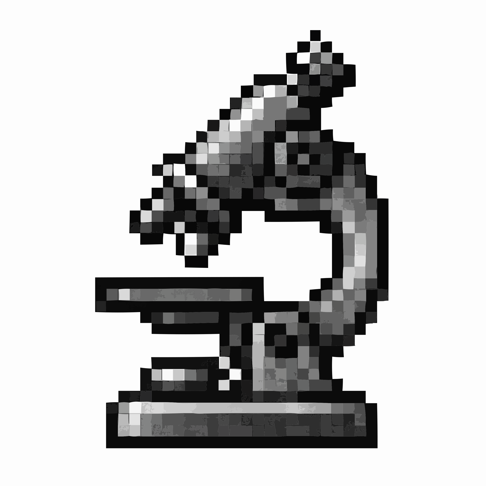

# MicroLive 

**Authors:** Luis U. Aguilera, William S. Raymond, Rhiannon M. Sears, Nathan L. Nowling, Brian Munsky, Ning Zhao

[](https://opensource.org/licenses/BSD-3-Clause)
[](https://www.python.org/downloads/release/python-312/)
[](https://pypi.org/project/PyQt5/)
[](docs/user_guide.md)
[](docs/tutorial.md)
[](docs/api_reference.md)

### About MicroLive

**MicroLive** is a Python library and GUI application designed to process live-cell microscope images and perform single-molecule measurements. It provides an intuitive interface for particle tracking, colocalization analysis, correlation analysis, and advanced visualization tools, making it ideal for quantitative microscopy research.


## Features

### 🔬 **Image I/O & Management**
- **Multi-format Support**: Load .lif (Leica), .tif, and .ome.tif files with automatic metadata extraction
- **Dimension Mapping**: Interactive mapping for arbitrary file dimensions to standard microscopy format [T, Z, Y, X, C]
- **File Management**: Tree view interface for managing multiple datasets simultaneously
- **Metadata Preservation**: Comprehensive metadata handling and export

### 🎯 **Particle Tracking**
- **Automated Detection**: Spot detection with customizable size and intensity filtering
- **Trajectory Linking**: Advanced linking algorithms with memory and search range controls
- **Clustering Analysis**: Handle aggregated particles with radius and size parameters
- **Quality Control**: Random spot generation for validation and trajectory length filtering
- **Real-time Visualization**: Live tracking overlays with customizable display options

### 🔍 **Colocalization Analysis**
- **ML-Based Detection**: Machine learning models for automated colocalization classification
- **Intensity-Based Methods**: Signal-to-noise ratio thresholds for spot colocalization
- **Manual Verification**: Grid-based interface for expert validation of automated results
- **Threshold Control**: Adjustable ML confidence or SNR thresholds
- **Comprehensive Export**: Visualization matrices and quantitative data export

### 📊 **Statistical Analysis**
- **Distribution Analysis**: Histogram plots of particle properties (intensity, size, SNR, cluster size)
- **Time Course Analysis**: Temporal analysis of particle metrics with percentile filtering
- **Correlation Analysis**: Auto- and cross-correlation with linear/exponential fitting
- **Photobleaching Correction**: Multiple model types (exponential, linear, double-exponential)

### 🎨 **Advanced Visualization**
- **Multi-channel Display**: Individual channel selection with ImageJ-style colormaps
- **Channel Merging**: Combine up to 3 channels with color mapping (green, magenta, yellow)
- **Interactive Navigation**: Frame-by-frame and Z-plane navigation with play controls
- **Background Removal**: Segmentation-based background removal and overlay options
- **Export Options**: High-resolution images, videos (MP4/GIF), and interactive plots

### 🗂️ **Data Export & Documentation**
- **Multiple Formats**: PNG (300 DPI), TIFF, OME-TIFF, CSV, and video formats
- **Batch Export**: Select and export multiple analysis results simultaneously
- **Metadata Logging**: Complete parameter documentation for reproducibility
- **User Annotations**: Custom comments and observations integrated with exports


-----

## 📚 Documentation

For comprehensive information about using Micro, please refer to our detailed documentation:

- **[📖 User Guide](docs/user_guide.md)** - Complete guide to using the Micro GUI interface
- **[🎓 Tutorial](docs/tutorial.md)** - Step-by-step tutorials for all analysis workflows  
- **[⚙️ API Reference](docs/api_reference.md)** - Technical documentation for developers and advanced users


# 🚀 Installation 

To install this repository and all its dependencies, we recommend using [Anaconda](https://www.anaconda.com).

## Quick Installation

### 1. Clone the Repository
```bash
git clone https://github.com/ningzhaoAnschutz/microlive.git
cd micro
```

### 2. Create Environment from YAML File
```bash
conda env create -f micro_env.yml
```

### 3. Activate Environment
```bash
conda activate micro
```

## Manual Installation

### 1. Create Virtual Environment
```bash
conda create -n micro python=3.12 -y
conda activate micro
```

### 2. Install Dependencies
```bash
pip install -r requirements.txt
```
See [requirements.txt](requirements.txt) for complete dependency list with versions.

-----

# 🖥️ Launching the GUI

## Quick Start

### Platform-Specific Launchers
- **macOS**: Double-click `micro_mac.command` in the `gui` directory
- **Windows**: Double-click `micro_windows.bat` in the `gui` directory

### Manual Launch
1. **Open Terminal/Command Prompt**

2. **Activate Environment**:
   ```bash
   conda activate micro
   ```

3. **Navigate to GUI Directory**:
   ```bash
   cd gui
   ```

4. **Launch Application**:
   ```bash
   python micro.py
   ```

## First-Time Setup

When launching Micro for the first time:

1. **Theme Selection**: Choose between dark and light themes (toggle in Display tab)
2. **Load Sample Data**: Use "Open File" to load your microscopy images
3. **Check Documentation**: Refer to the [User Guide](docs/user_guide.md) for detailed instructions
4. **Follow Tutorials**: Start with [Tutorial](docs/tutorial.md) for guided examples

-----

## 📁 Project Structure 

```
microlive/
├── 📁 src/                                                   # Core source code
│   ├── microscopy.py                                         # Main analysis classes and functions
│   └── imports.py                                            # Central import management
├── 📁 gui/                                                   # Graphical user interface
│   ├── micro.py                                              # Main GUI application
│   ├── micro_mac.command                                     # macOS launcher script
│   └── micro_windows.bat                                     # Windows launcher script
├── 📁 docs/                                                  # Documentation
│   ├── user_guide.md                                         # Complete user manual
│   ├── tutorial.md                                           # Step-by-step tutorials
│   ├── api_reference.md                                      # Technical API documentation
│   ├── gui_image.png                                         # GUI screenshot logo (PNG)
│   ├── 📁 icons/                                             # Folder with GUI icons
│   │   └── icon_micro                                        # Application logo (PNG, ICO, JPEG)
├── 📁 notebooks/                                             # Example Jupyter notebooks
│   ├── converter.ipynb                                       # Notebook to convert to standard format
├── 📁 modeling/                                              # Machine learning models
│   └── 📁 machine_learning/                                  # ML-based analysis tools
│       ├── ML_Pipeline_and_Data_Validation.ipynb             # Complete ML pipeline
│       └── particle_detection_cnn_human_selected_data.pth    # Trained model and weights
├── LICENSE                                                   # BSD 3-Clause License
├── requirements.txt                                          # Python dependencies
├── .gitignore                                                # Git ignore patterns
└── README.md                                                 # README file
```
-----


## 🎯 Quick Start Workflows

### Basic Particle Tracking
1. **Load Data**: Open your microscopy file (.lif or .tif)
2. **Segmentation**: Define cell boundaries (manual or automated)
3. **Detection**: Set threshold and spot parameters
4. **Tracking**: Link particles across time frames
5. **Export**: Save tracking data and visualizations


### Colocalization Analysis
1. **Complete Tracking**: Perform particle tracking on reference channel
2. **Select Channels**: Choose reference and target channels
3. **Run Analysis**: Execute ML-based or intensity-based colocalization
4. **Manual Verification**: Review and refine results manually
5. **Export Results**: Save quantitative data and visualization matrices


### Correlation Analysis
1. **Quality Tracking**: Ensure good quality particle trajectories
2. **Select Data**: Choose field and channels for analysis
3. **Configure Parameters**: Set fit type and lag ranges
4. **Run Analysis**: Execute auto- or cross-correlation
5. **Interpret Results**: Analyze correlation curves and fitted parameters

-----

## 🤝 Contributing

We welcome contributions to MicroLive! Here's how you can help:

### Reporting Issues
- Use the [GitHub Issues](https://github.com/ningzhaoAnschutz/microlive/issues) page
- Provide detailed descriptions and steps to reproduce
- Include system information and error messages

### Contributing Code
1. Fork the repository
2. Create a feature branch (`git checkout -b feature/new-feature`)
3. Make your changes and add tests
4. Commit your changes (`git commit -am 'Add new feature'`)
5. Push to the branch (`git push origin feature/new-feature`)
6. Create a Pull Request

### Development Guidelines
- Follow PEP 8 style guidelines
- Add docstrings to all functions and classes
- Include unit tests for new functionality
- Update documentation as needed

-----

## 📄 License

This project is licensed under the BSD 3-Clause License - see the [LICENSE](LICENSE) file for details.

-----

## 📞 Support and Contact

- **Documentation**: [User Guide](docs/user_guide.md) | [API Reference](docs/api_reference.md) | [Tutorial](docs/tutorial.md)
- **Issues**: [GitHub Issues](https://github.com/ningzhaoAnschutz/microlive/issues)
- **Discussions**: [GitHub Discussions](https://github.com/ningzhaoAnschutz/microlive/discussions)

For questions about specific research applications or collaborations, please contact the development team.

-----

## 🏆 Citation

If you use Micro in your research, please cite it as follows:

> **Luis U. Aguilera, William S. Raymond, Rhiannon M. Sears, Nathan L. Nowling, Brian Munsky, Ning Zhao** *MicrLive: An Image Processing Toolkit for Quantifying Live-cell Single-Molecule Microscopy.* GitHub, 2025.  
> [https://github.com/luisub/micro](https://github.com/ningzhaoAnschutz/microlive)  
> Licensed under the BSD 3-Clause License.


### BibTeX Entry
```bibtex
@misc{Aguilera2025Micro,
  author       = {luisub},
  title        = {MicroLive: An Image Processing Toolkit for Quantifying Live-cell Single-Molecule Microscopy.},
  year         = {2025},
  publisher    = {GitHub},
  howpublished = {\url{https://github.com/ningzhaoAnschutz/microlive}},
  note         = {Licensed under the BSD 3-Clause License},
  keywords     = {microscopy, single-molecule, particle tracking, colocalization, image analysis}
}
```

-----

**🚀 Ready to get started?** Check out our [Tutorial](docs/tutorial.md) for step-by-step examples!