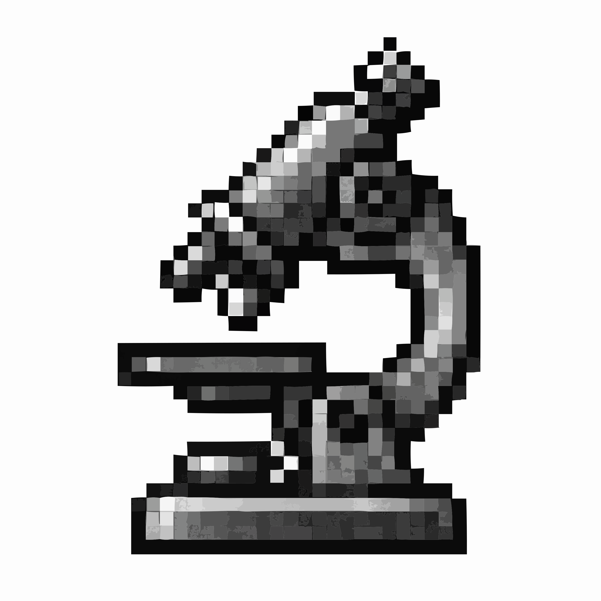

# MicroLive 

**Authors:** Luis U. Aguilera, William S. Raymond, Rhiannon M. Sears, Nathan L. Nowling, Brian Munsky, Ning Zhao

[](docs/user_guide.md) [](docs/tutorial.md) [](docs/api_reference.md) [](https://www.gnu.org/licenses/gpl-3.0) [](https://www.python.org/downloads/release/python-312/) [](https://pypi.org/project/PyQt5/)

## About

**MicroLive** is a Python-based GUI application for live-cell microscopy image analysis and single-molecule measurements. It provides an end-to-end workflow from image loading through particle tracking, colocalization analysis, and statistical analysis.


---

## Features

- **Image I/O**: Load .lif, .tif, .ome.tif with metadata extraction and dimension mapping
- **Registration**: Drift correction via phase correlation
- **Segmentation**: Cellpose (GPU), watershed, manual ROI, or external mask import
- **Photobleaching correction**: Exponential decay modeling
- **Particle tracking**: 2D (TrackPy) and 3D (Big-FISH) detection with multi-channel support
- **Automated threshold detection**: Hybrid Big-FISH/TrueSpot method
- **Trajectory linking**: Nearest-neighbor with memory and cluster analysis
- **Intensity quantification**: Background subtraction, PSF fitting, SNR calculation
- **Colocalization**: CNN-based, distance-based, and manual verification
- **MSD analysis**: Per-cell diffusion coefficient calculation
- **Correlation**: Auto- and cross-correlation with exponential/linear fitting
- **Export**: PNG, TIFF, CSV, MP4/GIF with full metadata logging

---

## Documentation

- **[User Guide](docs/user_guide.md)** — Complete guide to using MicroLive
- **[Tutorial](docs/tutorial.md)** — Step-by-step tutorials for all workflows
- **[API Reference](docs/api_reference.md)** — Technical documentation for developers

---

## Installation

We recommend using [Anaconda](https://www.anaconda.com) for environment management.

### 1. Clone the Repository

```bash
git clone https://github.com/ningzhaoAnschutz/microlive.git  
cd microlive 
```

### 2. Create Environment

**macOS (Apple Silicon):**

```bash
conda env create -f installation/micro_mac.yml
conda activate micro_mac
```

**Windows (NVIDIA GPU):**

```bash
conda env create -f installation/micro_windows.yml
conda activate micro_windows
```

### Alternative: Pip Installation

```bash
# macOS
pip install -r installation/requirements_mac.txt

# Windows (with CUDA GPU support)
pip install -r installation/requirements_windows.txt
```

---

## Launching MicroLive

**Platform launchers:**

- macOS: Double-click `gui/micro_mac.command`
- Windows: Double-click `gui/micro_windows.bat`

**Manual launch:**

```bash
conda activate micro_mac  # or micro_windows
cd gui
python micro.py
```

---

## Project Structure

```text
microlive/
├── src/                          # Core analysis library
│   ├── microscopy.py             # Main analysis classes
│   ├── imports.py                # Central import management
│   ├── ML_SpotDetection.py       # ML-based spot detection
│   └── pipelines/                # Analysis pipeline modules
├── gui/                          # GUI application
│   ├── micro.py                  # Main GUI application
│   ├── micro_mac.command         # macOS launcher
│   └── micro_windows.bat         # Windows launcher
├── docs/                         # Documentation
│   ├── user_guide.md             # User manual
│   ├── tutorial.md               # Step-by-step tutorials
│   └── api_reference.md          # API documentation
├── modeling/                     # Machine learning models
├── notebooks/                    # Example Jupyter notebooks
├── installation/                 # Environment and dependency files
│   ├── micro_mac.yml             # Conda environment (macOS)
│   ├── micro_windows.yml         # Conda environment (Windows GPU)
│   ├── requirements_mac.txt      # Pip dependencies (macOS)
│   └── requirements_windows.txt  # Pip dependencies (Windows GPU)
└── LICENSE                       # GPL v3 License
```

---

## License

This project is licensed under the GNU General Public License v3 (GPLv3). See [LICENSE](LICENSE) for details.

---

## Citation

If you use MicroLive in your research, please cite:

> **Aguilera LU, Raymond WS, Sears RM, Nowling NL, Munsky B, Zhao N.** *MicroLive: An Image Processing Toolkit for Quantifying Live-cell Single-Molecule Microscopy.* GitHub, 2025.
> [https://github.com/ningzhaoAnschutz/microlive](https://github.com/ningzhaoAnschutz/microlive)

```bibtex
@misc{Aguilera2025MicroLive,
  author       = {Aguilera, Luis U. and Raymond, William S. and Sears, Rhiannon M. and Nowling, Nathan L. and Munsky, Brian and Zhao, Ning},
  title        = {MicroLive: An Image Processing Toolkit for Quantifying Live-cell Single-Molecule Microscopy},
  year         = {2025},
  publisher    = {GitHub},
  howpublished = {\url{https://github.com/ningzhaoAnschutz/microlive}},
  note         = {Licensed under GPL v3}
}
```

---

## Support

- **Documentation**: [User Guide](docs/user_guide.md) | [Tutorial](docs/tutorial.md) | [API Reference](docs/api_reference.md)
- **Issues & Contributions**: [GitHub](https://github.com/ningzhaoAnschutz/microlive/issues)
